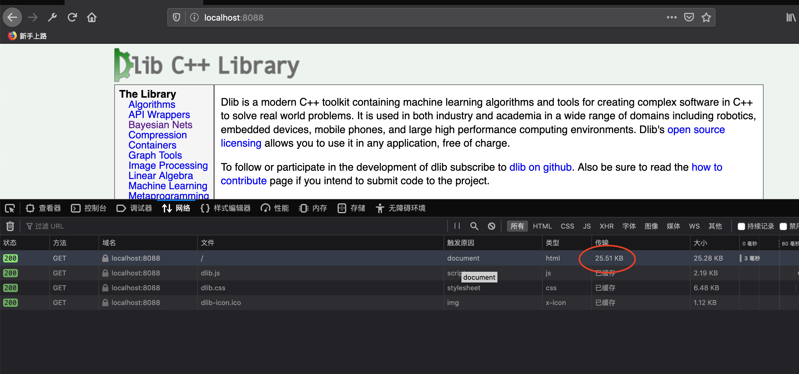
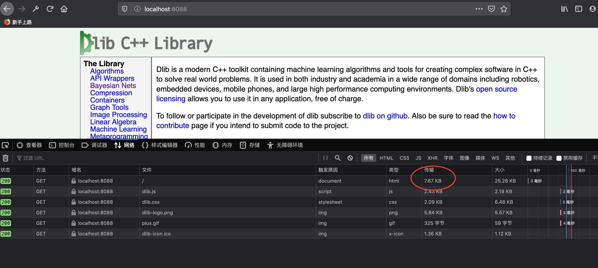
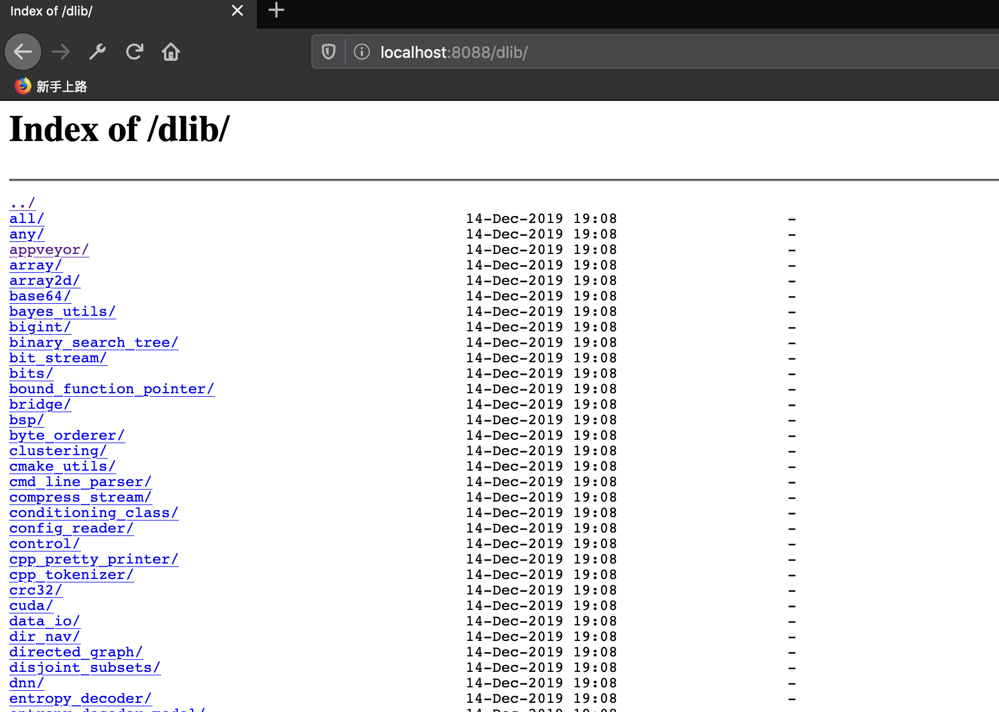

# 使用Nginx搭建静态资源WEB服务器

[toc]

## 一、下载一个静态WEB资源示例

从这个网站中可以下载dclib的静态资源示例：

> https://sourceforge.net/projects/dclib/

## 二、将静态资源放到nginx目录下

> /dev/servers/nginx/dlib

```shell
$tree dlib | more
dlib
├── CMakeLists.txt.html
├── algs.h.html
├── all
│   └── source.cpp.html
├── any
│   ├── any.h.html
│   ├── any_abstract.h.html
│   ├── any_decision_function.h.html
│   ├── any_decision_function_abstract.h.html
│   ├── any_function.h.html
│   ├── any_function_abstract.h.html
│   ├── any_function_impl.h.html
│   ├── any_function_impl2.h.html
│   ├── any_trainer.h.html
│   └── any_trainer_abstract.h.html
├── any.h.html
├── appveyor
......
```

## 三、配置Nginx

- 配置需要监听的端口

- 配置一个location

  > 配置的时候一定要注意语法问题，使用“;”结尾
  >
  > 可以使用`./sbin/nginx -t` 检查语法是否有问题

  ```shell
      server {
          listen       8088;
          server_name  localhost;
  
          #charset koi8-r;
  
          #access_log  logs/host.access.log  main;
  
          location / {
              alias  dlib/;
              #root   html;
              #index  index.html index.htm;
          }
  ```

  所有的访问请求都访问`dlib`下面的文件，`location`后面的`/`表示所有的请求。

  需要指定url的后缀与文件名的后缀一一对应，这个时候有两种用法：

  （1）使用`root`

  > 使用`root`有一个问题，它会将Url的路径带到目录中来。所以一般使用`alias`

  （2）使用`alias`

  这里的含义是，location后面的路径与 `dlib`目录的路径一一对应。

  ## 四、启动nginx

  ```shell
  cd /dev/servers/nginx/sbin
  ./nginx
  ```

  ## 五、访问

  > http://localhost:8088/

  

  ## 六、其他功能

  ### 6.1 GZIP压缩

  这时候通过查看抓包的大小，发现所抓包的大小和文件大小一致。

  **所有的文本可以做GZIP压缩的**，压缩之后的大小会大幅度减少。

  

  打开gzip压缩：

  ```shell
      # 开启gzip压缩
      gzip  on;
      # 小于 1字节 的不压缩
      gzip_min_length 1;
      # gzip 压缩的级别
      gzip_comp_level 2;
      # 对哪些文件进行压缩
      gzip_types text/plain application/x-javascript text/css application/xml text/javascript application/x-httpd-php image/jpeg image/gif image/png;
  
      server {
          listen       8088;
          server_name  localhost;
  ......
  ```

  重启nginx：

  >  ./sbin/nginx -s reload

  再次访问：

  

  

### 6.2 使用 autoindex 来共享资源文件

这个访问“/”结尾的URL，可以在页面上展示目录结构：




### 6.3 使用`$limit_rate`限制访问速度

> http://nginx.org/en/docs/http/ngx_http_core_module.html#limit_rate

```shell

        location / {
            alias  dlib/;
            autoindex on;
            set $limit_rate 1k;
            #root   html;
            #index  index.html index.htm;
        }
```

再次访问首页，发现访问速度非常慢

### 6.4 记录access日志

- 定义日志格式

- 对日志格式进行命名

  > 上面的`main`就是对日志格式的命名

- 设置日志记录在在哪

  ```shell
  http {
  ......
      # 日志的一种格式
      log_format  main  '$remote_addr - $remote_user [$time_local] "$request" '
                        '$status $body_bytes_sent "$http_referer" '
                        '"$http_user_agent" "$http_x_forwarded_for"';
  
      # 日志记录的位置，采用名称为“main” 的日志格式
      access_log  logs/access.log  main;
  ......
  ```

  

  