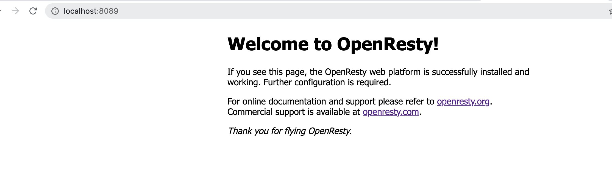

# 使用Nginx搭建反向代理

[toc]

## 一、什么叫反向代理

比如，用Nginx作为静态资源服务器，搭建一个WEB服务，那么这个静态资源的WEB就称为“上游服务”。现在要搭建另外一一个Nginx，来访问“上游服务”，这个过程就叫反向代理。

这样做要达成的效果：通过代理，将请求转发给多个上游服务处理，实现负载均衡、容灾（某一个上游服务出问题，转交给另一个处理）。

## 二、搭建代理服务器的示例

### 2.1 修改上游服务的Nginx配置，只让本机能够访问

> 一般上游服务是不对公网访问的

```shell
    server {
        #listen       8088;
        # 加上一个本地ip，表示只有本机能访问8088端口
        listen       127.0.0.1:8088;
 ......
```

为了防止之前的ip仍然能访问，先将nginx停掉，再启动：

```shell
./sbin/nginx -s stop
./sbin/nginx
```

### 2.2 搭建另外一个Nginx， 使用OpenResty

下载并 编译openResty：

```shell
./configure \
--with-cc-opt="-I/usr/local/opt/openssl/include/ -I/usr/local/opt/pcre/include/" \
--with-ld-opt="-L/usr/local/opt/openssl/lib/ -L/usr/local/opt/pcre/lib/" \
-j8
make
make install
```

安装完成之后，运行的目录位于：

> /usr/local/openresty/nginx/sbin/

### 2.3 简单修改配置文件后运行nginx

> 将端口修改为8089后访问



### 2.4 将openResty当作反向代理服务器，在它的配置文件中配置上游服务


```shell
    # 添加一个上游服务
    upstream local {
        server 127.0.0.1:8088;
    }


    server {
        listen       8089;
        server_name  localhost;
        ......
        location / {
            # 将客户的ip发给上游服务，否则上游服务拿到的ip是反向代理的ip
            proxy_set_header Host $host;
            proxy_set_header X-Real-IP $remote_addr;
            proxy_set_header X-Forwarded-For $proxy_add_x_forwarded_for;
            
            #root   html;
            #index  index.html index.htm; 
            # 对所有的请求, 代理到上游服务
            proxy_pass http://local;
        }
        ......
```

然后重启openResty: `sudo ./sbin/nginx -s reload`


## 三、配置缓存服务器

```shell
http{
    # 配置缓存文件存放的目录
    proxy_cache_path /tmp/nginxcache levels=1:2 keys_zone=my_cache:10m max_size=10g inactive=60m use_temp_path=off;
    ......
    server{
        ......
            location / {
            # 将客户的ip发给上游服务，否则上游服务拿到的ip是反向代理的ip
            proxy_set_header Host $host;
            proxy_set_header X-Real-IP $remote_addr;
            proxy_set_header X-Forwarded-For $proxy_add_x_forwarded_for;

            #root   html;
            #index  index.html index.htm;

            proxy_cache my_cache;
            proxy_cache_key $host$uri$is_args$args;
            proxy_cache_valid 200 304 302 1d;
            # 对所有的请求, 代理到上游服务
            proxy_pass http://local;
        }
        .......
    }
}
```

访问两次反向代理服务器之后，将上游服务停掉`./sbin/nginx -s stop`

再次访问反向代理，仍然能够放到到请求。

