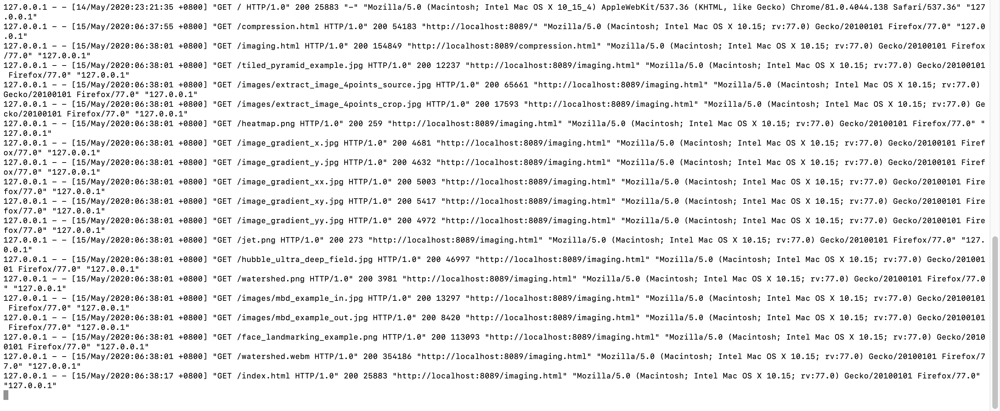
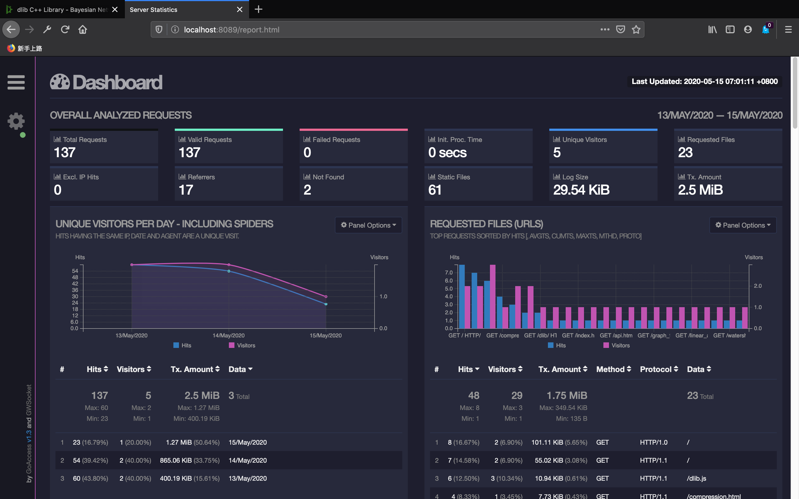
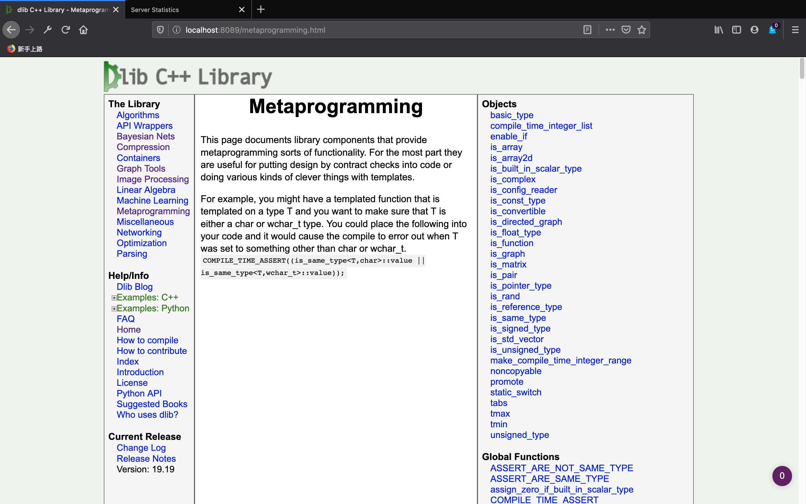

# 借助AccessLog实时以图形化的方式分析nginx的access日志

[toc]

## 一、安装accesslog

官网：https://goaccess.io/

`brew install goaccess`

````
If you need to have gettext first in your PATH run:
  echo 'export PATH="/usr/local/opt/gettext/bin:$PATH"' >> ~/.bash_profile

For compilers to find gettext you may need to set:
  export LDFLAGS="-L/usr/local/opt/gettext/lib"
  export CPPFLAGS="-I/usr/local/opt/gettext/include"
````

## 二、GoAccess的工作原理

内部使用websocket协议，实时推送消息

## 三、GoAccess的简单使用

### 3.1 启动nginx

`./sbin/nginx`

### 3.2 默认日志格式的内容



### 3.3 配置nginx，并启动GoAccess

- 配置nginx

  ```shell
   http{
   ......
          # 当访问 report.html 重定向到目标的html
          location /report.html {
              alias /Users/lifei/Downloads/dev/servers/nginx/html/report.html;
          }
            
          location / {
              alias  dlib/;
              .......
  }
  ```

  

> goaccess access.log -o ../html/report.html --real-time-html --time-format='%H:%M:%S' --date-format='%d/%b/%Y' --log-format=COMBINED 

该命令使用`-o`将`access.log`的内容以`report.html`中的图表展示出来。并指定时间格式，日期格式，以及日志格式。

当`access.log`变迁的时候，会新启一个websocket进程，将日志推送给GoAccess。

**出现的问题**：

```shell
已解析 1 行出现以下错误:

Token '13/May/2020' doesn't match specifier '%d'

格式错误 - 请检查你的日志/日期/时间格式
```

查一查，可能的原因是：1.3 版本是重大升级，添加国际化的内容。

> 参考：https://zju.date/goaccess-notes/

因此按照下面的方式运行：

> LANG="en_US.UTF-8"  bash -c 'goaccess access.log -o ../html/report.html --real-time-html --time-format='%H:%M:%S' --date-format='%d/%b/%Y' --log-format=COMBINED '



每当点击下面页面的请求时，上面的数据都会更新：

